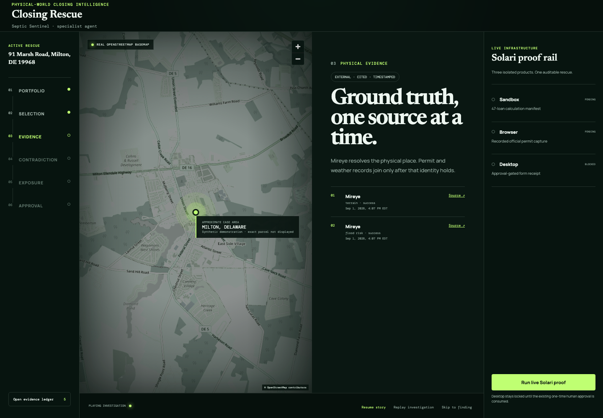
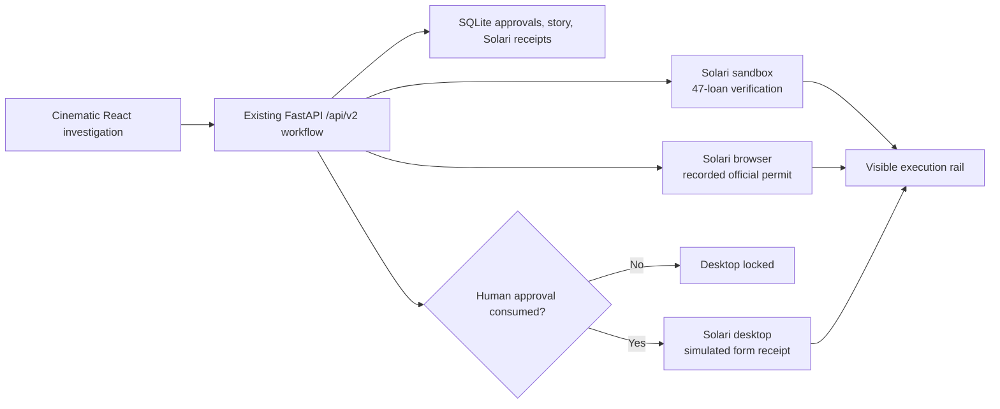

# Closing Rescue on Solari

Closing Rescue is a cinematic, local-first operations product that scans a deterministic 47-loan mortgage portfolio and finds the one septic-permit contradiction most likely to delay closing. It calculates the avoidable exposure, proposes a synthetic inspection slot, and stops at a durable one-time human approval before any GUI action.



This is a real use of all three Solari products:

- **Sandbox:** sends all 47 loans and their raw formula inputs to an isolated microVM. The guest independently checks every exposure calculation, preserves `contradiction` versus `no_match`, and returns a hash-addressed manifest with the input hash, flagged cases, formula version, and exit status.
- **Browser:** discovers a current permit through the [Delaware Open Data API](https://data.delaware.gov/Energy-and-Environment/Permitted-Septic-Systems/mv7j-tx3u), follows the returned official DNREC detail URL in a recorded Solari browser, redacts parcel, address, owner, permittee, issued-to, officer, and contact fields before recording, and captures a screenshot, citation, session ID, and replay.
- **Desktop:** remains locked until the existing approval token is consumed. It then opens a non-submittable local inspection-request form in a Solari desktop, adds a visible verification mark with GUI input, and captures a screenshot receipt. It never books or pays for anything.

## Run locally

Prerequisites: Python 3.11+, [uv](https://docs.astral.sh/uv/), Node.js 22+, and one Solari API key.

```bash
cp .env.example .env
# add SOLARI_API_KEY=slr_live_... to .env
make install
make start
```

Open [http://localhost:5173](http://localhost:5173), select **Start the rescue**, and use **Run live Solari proof** in the right rail. `make start` is the single command that launches FastAPI and the Vite app; both processes are cleaned up together on exit.

Fixture mode is deterministic and contains no lender, borrower, vendor-customer, or real loan data. Without `SOLARI_API_KEY`, the complete product and test suite still run, while the explicit live-proof endpoint returns `503` instead of pretending a cloud run occurred.

## Deploy to Vercel

The fixture application is live at [closing-rescue.vercel.app](https://closing-rescue.vercel.app). The committed `vercel.json`, Python Function entrypoint, and root build package reproduce it:

```bash
vercel deploy .
```

Unconfigured previews use deterministic fixture mode and ephemeral `/tmp` SQLite storage. Their live-proof control is visibly disabled instead of producing a fake cloud receipt. After claiming a deployment, configure persistent storage before production use; set both a newly rotated `SOLARI_API_KEY` and `VITE_SOLARI_LIVE_AVAILABLE=true` only if reviewers should run billable live proofs. Never reuse a key exposed in chat or commit it to the repository.

## Reviewer walkthrough

1. Start the 47-loan investigation and watch the six persisted chapters.
2. Open the evidence ledger to verify truth labels, citations, and timestamps.
3. Run the Solari proof. Inspect the sandbox manifest and browser replay/screenshot in the execution rail.
4. Skip to the finding. Confirm the $18,000 / $4,800 / $13,200 formulas are disclosed.
5. Approve the simulated rescue. The desktop unlocks only after the one-time approval, fills the non-submittable form, and adds its receipt to the rail.

## Architecture



The Solari orchestration depends on three small adapter protocols. Ordinary CI uses deterministic fakes; the live implementations use the official Python SDKs (`solari-browser==0.1.2`, `solari-sandbox==0.2.0`, `solari-desktop==0.2.0`). Browser sessions use the SDK session lifecycle with gateway-compatible Playwright CDP. Each billable resource has its own timeout and `finally` cleanup. One product failure is persisted as a partial failure and does not erase the other receipts.

## Verification

```bash
make test          # 407 backend tests + 63 frontend tests
make lint          # Ruff + TypeScript
make build         # production Vite bundle
make test-e2e      # Chromium desktop, Pixel 7, and reduced-motion journeys
make secret-scan   # tracked-file live-secret patterns
make audit         # Python and npm vulnerability audits
make smoke-deploy  # built SPA + API liveness + database readiness
make smoke-solari  # one real run of all three products; requires SOLARI_API_KEY
```

Tests cover deterministic ranking, contradiction/no-match distinctions, formulas, approval recovery, token enforcement, redaction, timeouts, partial failures, idempotency, and exact-once fake-resource cleanup. The live smoke command fails clearly when no key is configured and prints only redacted public receipts when it succeeds.

The September 1, 2026 live walkthrough passed across all three products and produced independently inspectable receipts in [`artifacts/live-proof`](artifacts/live-proof). The manifest covers all 47 loans, the recorded-browser screenshot is ownership-redacted, and the approval-gated desktop screenshot visibly contains the complete simulation-only form with submission disabled. Expiring replay URLs and operational session identifiers are intentionally omitted from the public pack.

## Data and safety

- Ownership-adjacent fields are excluded from discovery and rewritten before both browser recording and screenshot capture.
- The evidence chapter uses a real OpenStreetMap basemap, but its marker is fixed at a town-level synthetic demonstration point and is never geocoded from the case address.
- API keys, cookies, browser endpoints, and owner fields are rejected from persisted receipt text.
- Only hash-named JSON/image artifacts are served; paths are constrained to the configured artifact directory.
- The desktop form is a local text document, visibly labeled simulation-only, with no submission mechanism.
- Browser, sandbox, and desktop sessions are independently closed and killed/released.

See [docs/ARCHITECTURE.md](docs/ARCHITECTURE.md), [docs/PRIVACY.md](docs/PRIVACY.md), and [docs/LIMITATIONS.md](docs/LIMITATIONS.md) for deeper boundaries. Persistent production storage, a 60–90 second demo recording, and LinkedIn/X publication remain; nothing will be published without explicit approval.
