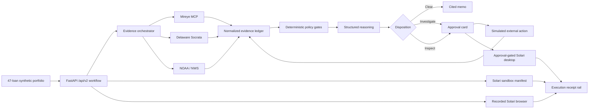
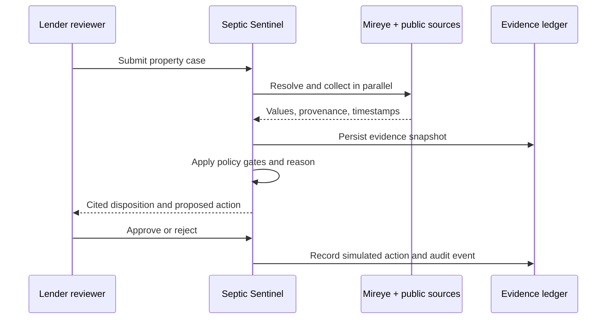

# Architecture

## System view

## Deep boundaries

- `adapters/` hides each external protocol and converts responses into the same evidence envelope.
- `orchestrator.py` resolves the property first, then collects independent sources concurrently.
- `policy.py` owns non-negotiable safety gates. The language model cannot bypass them.
- `reasoner.py` separates cited observations from inferences and produces a typed decision.
- `actions.py` owns one-time approvals, idempotency, and simulated delivery.
- `repository.py` owns SQLite persistence, immutable decision snapshots, and append-only audit events.
- `solari_execution.py` owns the three typed product adapters, per-resource cleanup, timeouts, redacted artifacts, and partial-failure semantics.
- `api.py` exposes a versioned contract and never logs request bodies.

## Case sequence

## Trust model

External content is untrusted data. The model receives normalized payloads with owner and geometry fields removed, cannot invent evidence, and cannot authorize actions. Ambiguous locations, missing required evidence, and material source failures block clearance.
